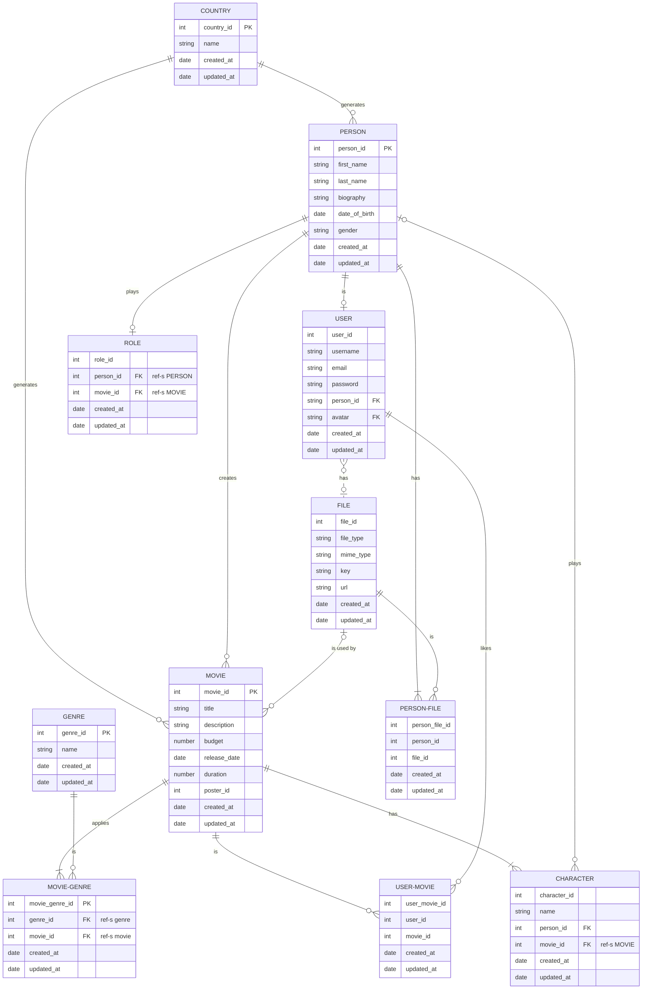

```mermaid
erDiagram
    MOVIE {
        int movie_id PK
        string title
        string description
        number budget
        date release_date
        number duration
        int poster_id
        date created_at
        date updated_at
    }
    PERSON {
        int person_id PK
        string first_name
        string last_name
        string biography
        date date_of_birth
        string gender
        date created_at
        date updated_at
    }
    COUNTRY {
        int country_id PK
        string name
        date created_at
        date updated_at
    }
    GENRE {
        int genre_id PK
        string name
        date created_at
        date updated_at
    }
    MOVIE-GENRE {
        int movie_genre_id PK
        int genre_id FK "ref-s genre"
        int movie_id FK "ref-s movie"
        date created_at
        date updated_at
    }
    
    USER {
        int user_id
        string username
        string email
        string password
        string person_id FK
        string avatar FK
        date created_at
        date updated_at
    }
    ROLE {
        int role_id
        int person_id FK "ref-s PERSON"
        int movie_id FK "ref-s MOVIE"
        date created_at
        date updated_at
    }
    CHARACTER {
        int character_id
        string name
        int person_id FK
        int movie_id FK "ref-s MOVIE"
        date created_at
        date updated_at
    }
    FILE {
        int file_id
        string file_type
        string mime_type
        string key
        string url
        date created_at
        date updated_at
    }
    USER-MOVIE {
        int user_movie_id
        int user_id
        int movie_id
        date created_at
        date updated_at
    }
    PERSON-FILE {
        int person_file_id
        int person_id
        int file_id
        date created_at
        date updated_at
    }
    COUNTRY ||--o{ PERSON : generates
    COUNTRY ||--o{ MOVIE : generates

    PERSON ||--o{ MOVIE : creates
    PERSON ||--o| USER : is
    PERSON ||--o| ROLE : plays
    PERSON ||--|{ PERSON-FILE : has

    MOVIE ||--|{ MOVIE-GENRE : applies
    MOVIE ||--o{ USER-MOVIE : is
    MOVIE ||--|{ CHARACTER : has

    USER }o..o| FILE : has
    USER ||--o{ USER-MOVIE : likes
    
    GENRE ||--o{ MOVIE-GENRE : is
    
    PERSON |o--o{ CHARACTER : plays

    FILE ||--o{ PERSON-FILE : is
    FILE |o--o{ MOVIE : "is used by"   
```