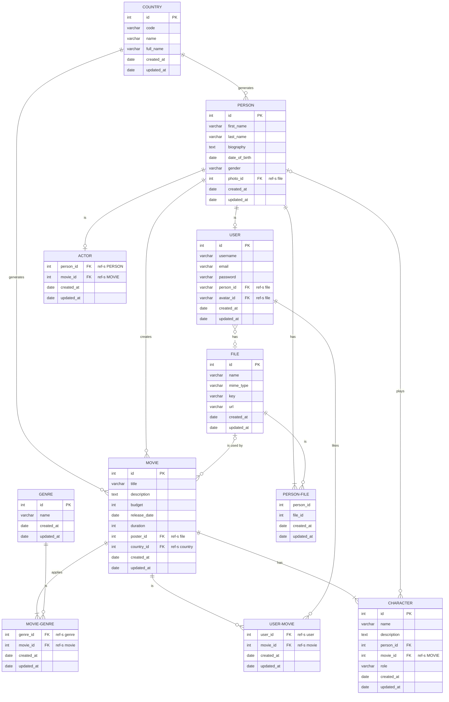

## Movie App Database

```mermaid
erDiagram
    MOVIE {
        int id PK
        varchar title
        text description
        int budget
        date release_date
        int duration
        int poster_id FK "ref-s file"
        int country_id FK "ref-s country"
        date created_at
        date updated_at
    }
    PERSON {
        int id PK
        varchar first_name 
        varchar last_name 
        text biography
        date date_of_birth
        varchar gender 
        int photo_id FK "ref-s file" 
        date created_at
        date updated_at
    }
    COUNTRY {
        int id PK
        varchar code
        varchar name
        varchar full_name
        date created_at
        date updated_at
    }
    GENRE {
        int id PK
        varchar name
        date created_at
        date updated_at
    }
    MOVIE-GENRE {
        int genre_id FK "ref-s genre" 
        int movie_id FK "ref-s movie" 
        date created_at
        date updated_at
    }
    
    USER {
        int id PK
        varchar username
        varchar email
        varchar password
        varchar person_id FK "ref-s file"
        varchar avatar_id FK "ref-s file"
        date created_at
        date updated_at
    }
    ACTOR {
        int person_id FK "ref-s PERSON" 
        int movie_id FK "ref-s MOVIE" 
        date created_at
        date updated_at
    }
    CHARACTER {
        int id PK
        varchar name 
        text description
        int person_id FK 
        int movie_id FK "ref-s MOVIE" 
        varchar role 
        date created_at
        date updated_at
    }
    FILE {
        int id PK
        varchar name
        varchar mime_type
        varchar key
        varchar url
        date created_at
        date updated_at
    }
    USER-MOVIE {
        int user_id FK "ref-s user"
        int movie_id FK "ref-s movie"
        date created_at
        date updated_at
    }
    PERSON-FILE {
        int person_id
        int file_id
        date created_at
        date updated_at
    }
    
    COUNTRY ||--o{ PERSON : generates
    COUNTRY ||--o{ MOVIE : generates

    PERSON ||--o{ MOVIE : creates
    PERSON ||--o| USER : is
    PERSON ||--o| ACTOR : is
    PERSON ||--|{ PERSON-FILE : has

    MOVIE ||--|{ MOVIE-GENRE : applies
    MOVIE ||--o{ USER-MOVIE : is
    MOVIE ||--|{ CHARACTER : has

    USER }o..o| FILE : has
    USER ||--o{ USER-MOVIE : likes
    
    GENRE ||--o{ MOVIE-GENRE : is
    
    PERSON |o--o{ CHARACTER : plays

    FILE ||--o{ PERSON-FILE : is
    FILE |o--o{ MOVIE : "is used by"   
```